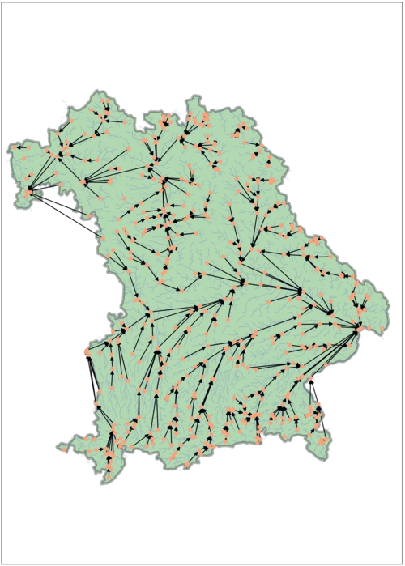

# CausalRivers  

## Scaling up benchmarking of causal discovery for real-world time-series

[](https://github.com/RichardLitt/standard-readme)

This is the official repository of [CausalRivers](https://openreview.net/forum?id=wmV4cIbgl6), the largest real-world Causal Discovery benchmark for time series to this date.
Also check our [Website](https://causalrivers.github.io/) where we will maintain the current leaderboard.



## Install

For the core benchmarking package simply run (uses conda, unzip and wget):

```bash
./install.sh
conda activate causalrivers
python 0_generate_datasets.py
```

Alternatively, you can execute the following commands by hand:

```bash
conda env create -f benchmark_env.yml
conda activate causalrivers
wget https://github.com/CausalRivers/benchmark/releases/download/First_release/product.zip
unzip product
rm product.zip
python 0_generate_datasets.py
```

## Functionality

This is the core benchmarking package, which only holds the core functionality and some tutorials on usage:

- How to build your graph subset:  [Custom graph sampling](1_custom_graph_sampling.ipynb)
- How to use the benchmark most efficiently:  [Usage](2_tutorial_benchmarking.ipynb)
- How to sub-select specific temporal windows with certain weather conditions: [Temporal selections](3_tutorial_subselect_weather_condition.ipynb)
- Some general display of dataset properties that might be interesting for users:  [Data distribution](4_data_distribution.ipynb)
- Graphical documentation as in our [Publication](https://openreview.net/pdf?id=wmV4cIbgl6):  [Graphics generation](graphics)

## Usage

We use Hydra to organize preprocessing and method Hyperparameters. Along with this we provide functions to load data and score results.
We keep a single baseline strategy (VAR) here that is used as a placeholder and can be replaced with your own method. To check how the scoring works simply run:

```bash
python 3_benchmark.py
```

This will run a var strategy with specified preprocessing on the "confounder 3" dataset and reproduce the scoring. For the remaining experimental results we refer to [the experiments repo](https://github.com/CausalRivers/experiments)

If you want to score your own method on a specific set of graph samples you can simply replace the baseline_method, configure it with hydra and run:

```bash
python 3_benchmark.py method=your_method_name otherparams=value
```

Of course you can also use any routine from  [the experiments repo](https://github.com/CausalRivers/experiments), especially concerning Grid searches and result aggregations.
Here, experiments were conducted on a computation cluster with the job submission system [slurm](https://slurm.schedmd.com/documentation.html) and also via [hydra](https://hydra.cc/) configurations.
However, the script can also be used on a single machine.

## CausalRivers Benchmark Dataset Explanation

The dataset consists of **three** `NetworkX` graph structures, **three** metadata tables, and **three** time series in `CSV` file format.
To facilitate matching between these different formats, each graph node shares a unique `ID` with its corresponding time series.

Additionally, the metadata table contains information about the individual nodes.

| Column Name   | Description                                                                                                                                         |
|:-------------:|-----------------------------------------------------------------------------------------------------------------------------------------------------|
| `ID`          | Unique ID                                                                                                                                           |
| `R`           | River name                                                                                                                                          |
| `X`           | X coordinate of measurement station (longitude)                                                                                                     |
| `Y`           | Y coordinate of measurement station (latitude)                                                                                                      |
| `D`           | Distance to the end of the river (or distance from source, encoded as negative numbers)                                                             |
| `H`           | Elevation of measurement station                                                                                                                    |
| `QD`          | Quality marker of the Distance                                                                                                                      |
| `QH`          | Quality marker of the Height                                                                                                                        |
| `QX`          | Quality marker of the X coordinate                                                                                                                  |
| `QY`          | Quality marker of the Y coordinate                                                                                                                  |
| `QR`          | Quality marker of the River name                                                                                                                    |
| `O`           | Origin of the node (data source)                                                                                                                    |
| `original_id` | ID of the station in the raw data before unification and reindexing (can be used to find the original station on online services of data providers) |

Furthermore, both ground truth nodes and edges (**in the graph**) hold additional information.

| Node Attribute | Description                             |
|:--------------:|-----------------------------------------|
| `p`            | X, Y coordinates                        |
| `c`            | color for consistency based on origin   |
| `origin`       | origin of the node                      |
| `H`            | as above                                |
| `R`            | as above                                |
| `D`            | as above                                |
| `QD`           | as above                                |
| `QH`           | as above                                |
| `QX`           | as above                                |
| `QY`           | as above                                |
| `QR`           | as above                                |

| Edge Attribute | Description                                                            |
|:--------------:|------------------------------------------------------------------------|
| `h_distance`   | elevation change between the two nodes                                 |
| `geo_distance` | Euclidean distance between the two nodes                               |
| `quality_geo`  | quality of the distance estimation (depends on QX and QY of the nodes) |
| `quality_h`    | quality of the elevation estimation (depends on QH of the nodes)       |
| `origin`       | strategy used to create this edge (see below for further information)  |

### Quality Values

The graph construction, particularly the edge determination, involves multiple strategies.
To ensure transparency and reliability, we provide quality markers for each piece of information.
These quality markers are defined as follows:

| Node Value     | Description                                                                 |
|:--------------:|-----------------------------------------------------------------------------|
| `-1`           | Unknown as target value missing                                             |
| `0`            | Original value                                                              |
| `> 0`          | Value that was estimated or looked up by hand (Check construction pipeline for more details) |

| Edge Value     | Description                                                                 |
|:--------------:|-----------------------------------------------------------------------------|
| `origin`       | The step under which the edge was added. E.g., origin 6 references to edges that were added as river splits by hand. |
| `quality_h`    | Sum of the quality of the corresponding Heights estimated of the connected nodes. E.g. 0 references that both height estimates were not estimated. |
| `quality_km`   | Sum of the quality of the corresponding coordinates (X, Y) estimated of the connected nodes. E.g. 0 references that both coordinates were not estimated. |

## Maintainers

Main: [@GideonStein](https://github.com/Gideon-Stein),
Code support: [@Timozen](https://github.com/Timozen)

## Contributors

This project exists thanks to the generous provision of data by the following German institutions:

- [Thüringer Landesamt für Umwelt, Bergbau und Naturschutz](https://tlubn.thueringen.de/)
- [Landesbetrieb für Hochwasserschutz und Wasserwirtschaft Sachsen-Anhalt](https://gld.lhw-sachsen-anhalt.de/)
- [Sächsisches Landesamt für Umwelt, Landwirtschaft und Geologie](https://www.umwelt.sachsen.de/umwelt/infosysteme/lhwz/index.html)
- [Landesamt für Umwelt, Naturschutz und Geologie Mecklenburg-Vorpommern](https://www.lung.mv-regierung.de/)
- [Senatsverwaltung für Mobilität, Verkehr, Klimaschutz und Umwelt](https://wasserportal.berlin.de/start.php)
- [Landesamt für Umwelt Brandenburg](https://lfu.brandenburg.de/lfu/de/)
- [Generaldirektion Wasserstraßen und Schifffahrt](https://www.gdws.wsv.bund.de/)
- [Bayerisches Landesamt für Umwelt](https://www.hnd.bayern.de/)

All data sources fall under the [data license Germany dl-de](https://www.govdata.de/dl-de/by-2-0)
